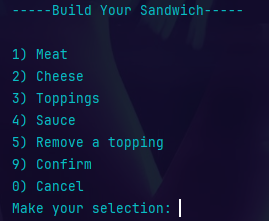

# Capstone 2
Here's a `README.md` for your Java project based on the code provided:

---

# DELI-cious Ordering System

Welcome to **DELI-cious**, a console-based Java application that simulates a deli sandwich shop's ordering system. This project enables users to build custom sandwiches, choose from signature options, and add drinks and chips to their orders. The application guides users through an interactive menu, processes their selections, and generates receipts.

## Features

* Start new orders and navigate through a home screen.
* Build your own sandwich with full customization:

    * Select size, bread, and toasting preference.
    * Add meats, cheeses, toppings, and sauces.
* Choose from signature sandwich options like:

    * Reuben, Cuban, BLT, Mushroom Swiss.
* Add sides like:

    * Chips (various flavors)
    * Drinks (Cola, Lemonade, Root Beer, etc.)
* View and remove items from the current order.
* Checkout and generate a receipt.

## Menus  

### Main menu:

  

### Order Menu:


### Sandwich Editor:



### Signature Sandwiches:


### Size Menu:


### Order Display:


### Checkout Menu:

  

## Code

Here is a piece of code I think is clever:

```java
public void addCheese(int selection) {
        boolean extra = toppings.stream().anyMatch(t -> t.getClass().equals(Cheese.class));

        switch (selection) {
            case 1 -> this.addTopping(new Cheese(CheeseType.AMERICAN, this.size, extra));
            case 2 -> this.addTopping(new Cheese(CheeseType.PROVOLONE, this.size, extra));
            case 3 -> this.addTopping(new Cheese(CheeseType.CHEDDAR, this.size, extra));
            case 4 -> this.addTopping(new Cheese(CheeseType.SWISS, this.size, extra));
            default -> System.out.println("Please select an available cheese.");
        }
    }
```

This method takes in an integer and uses it to add a type of cheese to the sandwich. The boolean 'extra' is a stream that checks the List of toppings for an occurrence of Cheese if there isn't one the cheese is regular, but if there is Cheese in the list already it is considered extra and different pricing is applied.